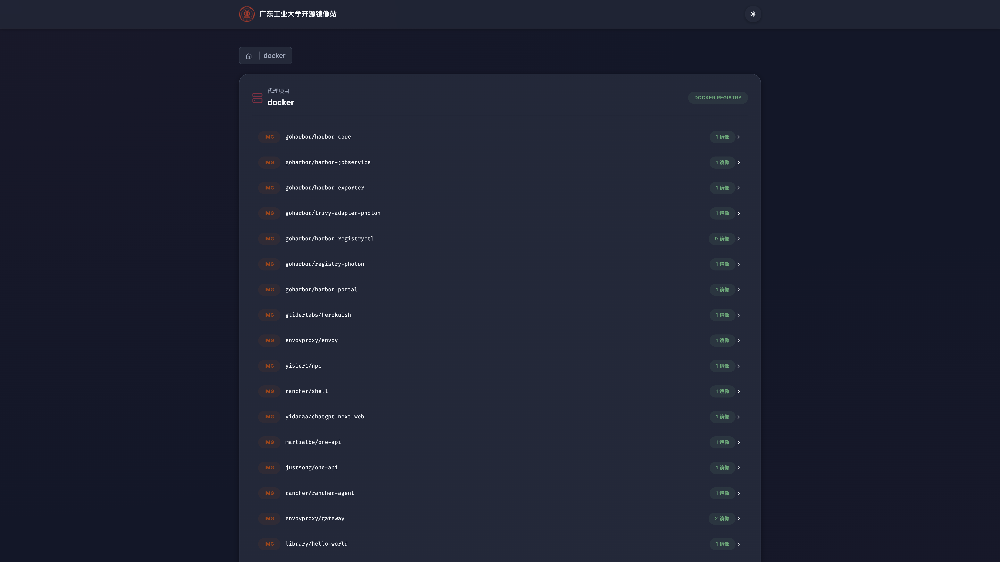
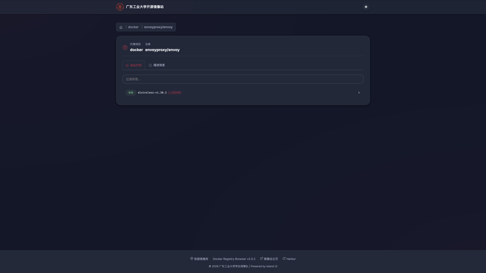
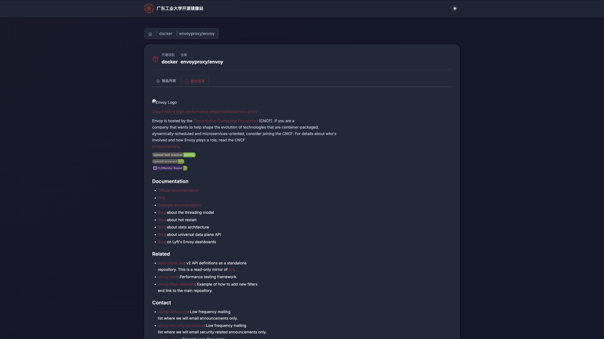
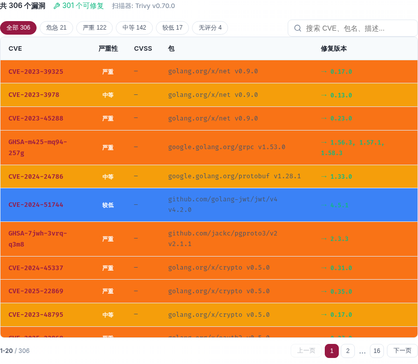
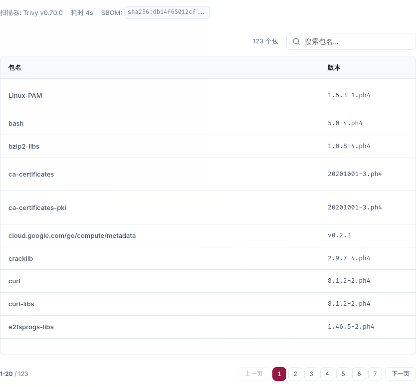

# Harbor Proxy Cache Browser

[Harbor](https://goharbor.io/) Proxy Cache 项目的 Web 浏览界面,使用 Ruby on Rails 编写。

Fork 自 [klausmeyer/docker-registry-browser](https://github.com/klausmeyer/docker-registry-browser),适配 Harbor 原生 API (`/api/v2.0/`) 和全局 Basic Auth 认证。

## 功能特性

- 浏览 Harbor Proxy Cache 项目,展示配额与存储使用量
- 在每个项目下导航仓库和标签
- 查看制品详情:Manifest、层信息、环境变量、构建历史
- 漏洞扫描结果展示:
  - 详情区漏洞分布堆叠条形图(危急/严重/中等/较低/无评分),右对齐
  - 按需 Turbo Frame 异步加载漏洞列表(不影响页面加载性能)
  - 分页表格(CVE/严重性/CVSS/包/修复版本),每页 20 条
  - 严重性筛选 chip(全部/危急/严重/中等/较低/无评分)
  - 实时搜索(CVE ID、包名、描述)
- SBOM 软件物料清单展示:
  - 按需 Turbo Frame 异步加载 SPDX 包列表
  - 四列表格(包名/版本/许可证/类型)+ 前端分页(每页 20 条)
  - 实时搜索过滤
  - 扫描状态感知(未扫描/进行中/失败/已完成)
- 双模式拉取命令,带滑块开关:
  - 前缀模式: `docker pull registry.example.com/docker/library/nginx:latest`
  - 镜像模式: `docker pull docker.registry.example.com/library/nginx:latest`
- 仓库描述信息 Tab,支持 Markdown 渲染
- 制品类型徽章(IMAGE、CHART、WASM、SBOM、CNAI 等)
- 明暗主题切换,支持系统偏好自动检测
- SVG 图标(Lucide 风格),响应式布局
- 分页、面包屑导航、底部栏自动贴底

## 截图

| 项目列表(首页) | 仓库列表 |
|:---:|:---:|
|  |  |
| 双列网格,展示配额进度条、仓库数量、空间使用量和创建时间 | 仓库下的标签列表,带制品类型徽章和过滤输入框 |

| 标签列表 | 仓库描述信息 |
|:---:|:---:|
|  |  |
| 标签详情拉取命令双模式切换 | 仓库描述信息 Tab,支持 Markdown 渲染 |

| 漏洞扫描 | SBOM 软件物料清单 |
|:---:|:---:|
|  |  |
| 漏洞分布堆叠条形图、分页表格、严重性筛选、实时搜索 | SPDX 包列表四列表格、分页、按需加载、实时搜索 |

## 快速开始

### Docker

```shell
docker run --name harbor-browser -p 8080:8080 \
  -e SECRET_KEY_BASE=$(openssl rand -hex 64) \
  -e HARBOR_URL=https://your-harbor.example.com \
  -e HARBOR_USERNAME=robot\$viewer \
  -e HARBOR_PASSWORD=your-robot-token \
  -e PUBLIC_REGISTRY_URL=https://registry.example.com \
  registry.example.com/docker-registry-browser:2.0.0
```

### Docker Compose

```yaml
version: "3"

services:
  frontend:
    build: .
    environment:
      - "SECRET_KEY_BASE=changeme"
      - "HARBOR_URL=https://registry.example.com"
      - "HARBOR_USERNAME=robot$view-registry"
      - "HARBOR_PASSWORD=your-robot-token"
      - "PUBLIC_REGISTRY_URL=https://registry.example.com"
      - "DOMAIN_MIRROR_MAP=ghcr.io:ghcr,quay.io:quay,registry.k8s.io:k8s"
      - "NO_SSL_VERIFICATION=true"
    ports:
      - "8080:8080"
```

### Kubernetes (Helm)

Helm Chart 以 OCI 形式存储在 Harbor 中,直接从 OCI registry 安装。OCI 不支持 `latest` 标签,需要指定版本号:

```shell
helm registry login registry.example.com --username robot\$deployer --password your-token

helm install harbor-browser \
  oci://registry.example.com/docker-registry-browser/docker-registry-browser-helm \
  --version 0.3.0 \
  --set environment.HARBOR_URL=https://registry.example.com \
  --set environment.PUBLIC_REGISTRY_URL=https://registry.example.com
```

Harbor 凭证应存储在 Kubernetes Secret 中,通过 `envFromSecrets` 引用:

```yaml
envFromSecrets:
  - harbor-credentials
```

## 配置

完整配置说明请参考 [docs/README.md](docs/README.md)。

### 关键环境变量

| 变量 | 说明 | 默认值 |
|---|---|---|
| `HARBOR_URL` | Harbor API 基础 URL | `http://localhost:8080` |
| `HARBOR_USERNAME` | Harbor 机器人账户用户名(必填) | - |
| `HARBOR_PASSWORD` | Harbor 机器人账户密码(必填) | - |
| `PUBLIC_REGISTRY_URL` | 用于生成 `docker pull` 命令的公开 URL | - |
| `DOMAIN_MIRROR_MAP` | 项目名到子域名的映射,用于镜像模式 | - |
| `PAGE_SIZE` | 每页条数 | `20` |
| `NO_SSL_VERIFICATION` | 跳过 SSL 证书验证 | `false` |
| `SECRET_KEY_BASE` | Rails 密钥(生产环境必填) | `changeme` |

## 技术栈

- Ruby 4.0.6 / Rails 8.1.3
- Faraday(Harbor API HTTP 客户端)
- Commonmarker(Markdown 渲染)
- Importmap + jQuery(前端资源)
- Puma(应用服务器)
- 基于 Alpine 的 Docker 镜像

## 许可证

基于 [MIT License](LICENSE) 开源。
